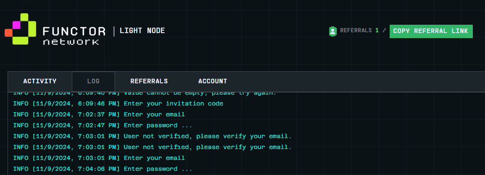
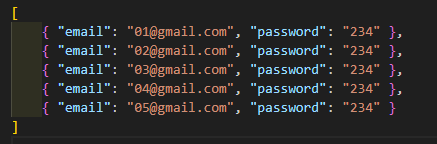

# Functor Network Auto checkin


**Functor Network** before start the script you must have account in [functor network](https://node.securitylabs.xyz/?from=extension&type=signin&referralCode=cm3g2v3d5b9b3o21bq4xck8y7)
- register to functor network [https://node.securitylabs.xyz/](https://node.securitylabs.xyz/?from=extension&type=signin&referralCode=cm3g2v3d5b9b3o21bq4xck8y7)
- insert invite code : `cm3g2v3d5b9b3o21bq4xck8y7`
- save your email and password 

# how to run 
## clone the repository
```bash
git clone https://github.com/rmndkyl/functor-bot.git
cd functor-bot
```
## install the requirements
```bash
npm install
```
## fill your email and password in `accounts.json`
```bash
nano accounts.json
```
**its support multyple accounts so just fill it like this**


## run the script
```bash
npm run start
```
